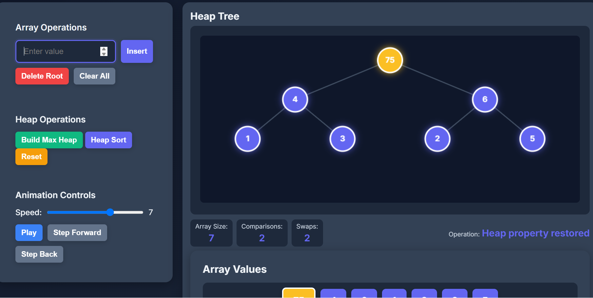
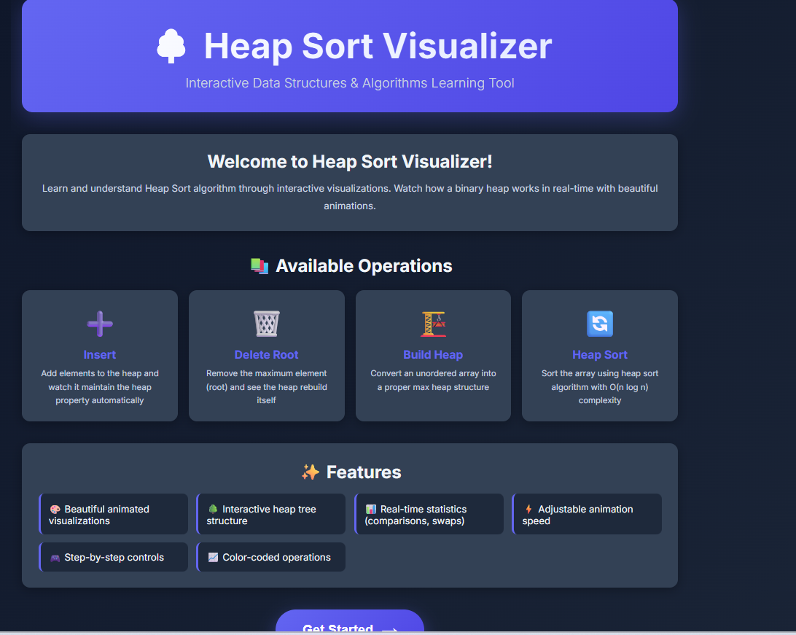
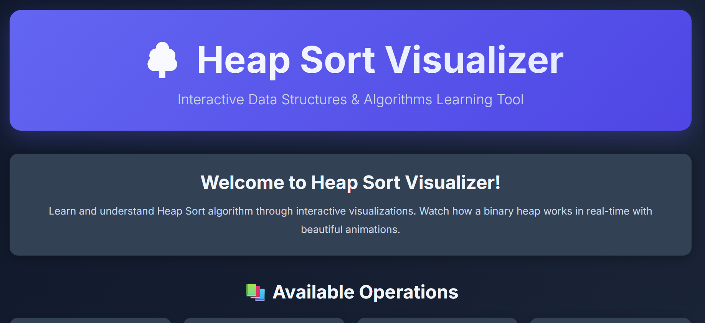

# 🌳 Heap Sort Visualizer — Interactive Web-Based Learning Tool

[](https://developer.mozilla.org/en-US/docs/Web/JavaScript)
[](https://developer.mozilla.org/en-US/docs/Web/HTML)
[](https://developer.mozilla.org/en-US/docs/Web/CSS)
[](LICENSE)

An interactive, web-based **Heap Sort visualizer** with animations and step-by-step explanations. This repository hosts the front-end visualization files and a small Python server to run the demo locally.

---

## ✨ Highlights

* Animated visualization of **heap construction** and **heap sort phases**
* Step-by-step UI controls: **play / pause / step forward / step backward**
* Lightweight and **dependency-free front-end** (HTML/CSS/JS)
* Simple Python server (`server.py`) that **opens your browser automatically**

---

## 📂 Files of Interest

* `index.html` — Main UI
* `visualizer.js`, `heap.js`, `app.js` — Visualization and logic
* `styles.css` — Styles for the UI
* `server.py` — Python server to run the demo locally
* `screenshot_and_videos/` — Screenshots and demo videos

---

## 🖼 Screenshots



---



---


---


## ⚡ Quickstart (Windows PowerShell)

**Prerequisites:** Python 3.7+ (no extra packages required unless `requirements.txt` is used)

1️⃣ (Optional) Create a virtual environment:

```powershell
python -m venv .venv
.\.venv\Scripts\Activate.ps1
if (Test-Path requirements.txt) { python -m pip install -r requirements.txt }
```

2️⃣ Start the server:

```powershell
python server.py
```

> The server runs on **port 8000** by default and opens your browser automatically.

3️⃣ Alternatively, for Node-based workflows:

```powershell
npm run start
```

---

## 🛠 How to Contribute

* Fork the repo and create a feature branch
* Add features, screenshots, or demo videos under `screenshot_and_videos/`
* Open a pull request and describe your changes clearly

---

```powershell
git rm -r --cached .
git add .
git commit -m "Apply .gitignore and update README"
git push
```

---

## ⚠️ Edge Cases to Consider

* Empty array: handled gracefully in the UI
* Very large arrays: animations may appear slow or crowded
* Browser compatibility: tested on modern **Chromium-based** browsers and **Firefox**

---

## 📄 License

MIT


## 🎬 Demo Video

